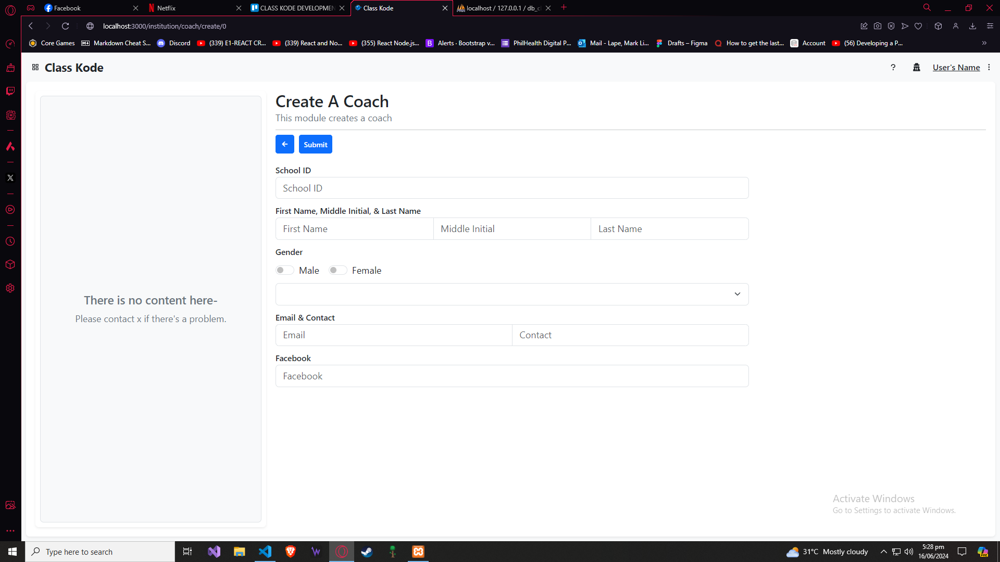
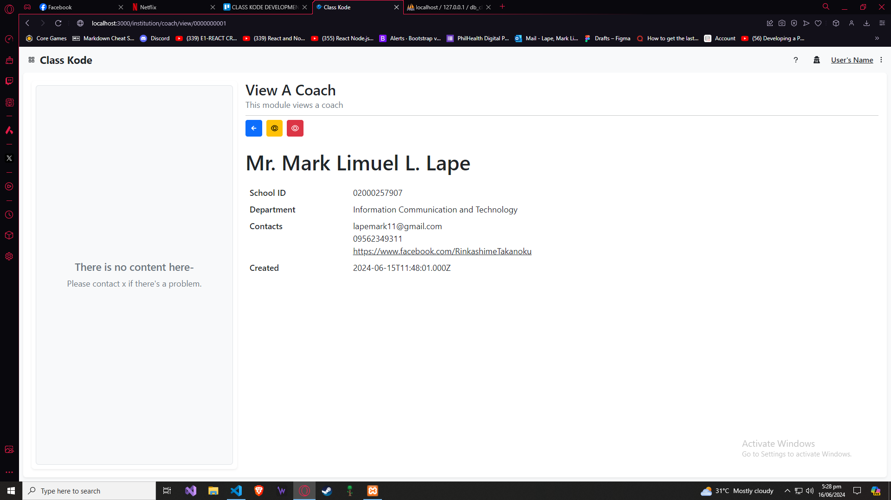
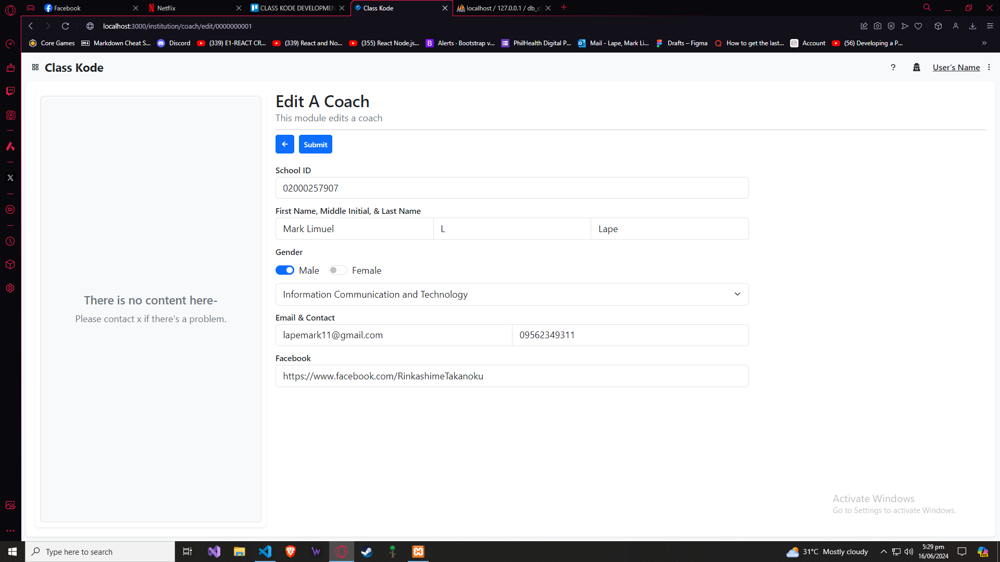

# CLASS KODE DEVELOPMENT LOGBOOK

> [!NOTE]
> CREATE A SYSTEM MANUAL IN SETTING UP THE APPLICATION
> CREATE A STABLE WEB HOSTING FOR THE FOLLOWING:
>
> 1. CLIENT SIDE
> 2. SERVER SIDE
> 3. DATABASE (MYSQL)
>    USER LEVEL MANUAL
>    SYSTEM LEVEL MANUAL

### LOGBOOK ENTRY UNRECORDED

1. STARTING TO OVERHAUL THE OVERALL SYSTEM
2. RESTORE THE NEW SYSTEM TO WORKING PROTOTYPE OF THE PREVIOUS CLASS KODE
3. CHANGES THE ICONS USED, NOW WILL BE USING REACT ICONS INSTEAD OF DOWNLOADING PNG FILES
4. MAJOR CHANGES FROM THE DASHBOARD SETUP HAVING FOUR (4) CARD CONTAINER CONTAINING TITLE, CONTENT, ALERT, AND A VIEW BUTTON.
5. INCLUDED THREE (3) GRAPHICAL GRAPHS.
6. SYSTEM’S RESPONSIVENESS UNTO ANY DEVICES ARE ATLEAST EIGTHY (80) PERCENT, SOME MAJOR PROBLEMS ARE THE HEADER, FINDING A WAY TO ATLEAST MAKE THE TEXT BE STATIC JUST LIKE THE NAVIGATION BAR / TOP BAR.
7. INITIALLY START UPDATING THE LAYOUT AND HOW EACH LAYOUT IS PASSED UNTO EACH MODULE.
8. RESOLVING THE ROUTES PROBLEM WITH MULTIPLE USER LEVEL.

### LOG ENTRY 1 - 16/06/2024

1. FILE MANAGEMENT ARE ORGANIZED SEPARATING EACH TYPE OF FILE BOTH CLIENT AND SERVER SIDED.
2. IMPROVE ALL TEMPLATE LAYOUT FOR EACH MODULES.
3. FILE MAINTAINANCE MODULES ARE WORKING PROPERLY, FUNCTIONALITIES WILL BE FORMED AS THE FOLLOWING:
   - CREATE AND VIEW
   - UNDER VIEW IS THE EDIT AND ARCHIVE
4. REVERTING THE TO OLDEST METHOD FOR THE CRUD FUNCTIONALITY (PER MODULE SETUP)
5. PASSING OF DATA WILL BE DONE USING THE LINK REACT TAG HAVING THE PARAMETERS OF TO AND STATE, STATE WILL CONTAIN THE OBJECT RATHER SEPARATED DATA. TO ACCESS THIS, IT WILL BE PASSED UNTO A STATE AND THAT STATE WILL BE THE TEMPORAL STORAGE OF THE DATA.
6. PASSING OF DATA WILL BE DONE USING THE LINK REACT TAG HAVING THE PARAMETERS OF TO AND STATE, STATE WILL CONTAIN THE OBJECT RATHER SEPARATED DATA. TO ACCESS THIS, IT WILL BE PASSED UNTO A STATE AND THAT STATE WILL BE THE TEMPORAL STORAGE OF THE DATA.
7. DATABASE IS ALSO REDO, MOST OF THE FORMAT IS THE SAME BUT THE ID WILL BE LENGTH OF TEN (10), ALL ATTRIBUTES THAT MAY CHANGE WILL BE SUBJECTED AS AN ENTITY SUCH AS COMPONENT, ACADEMIC LEVEL, AND MORE.

### LOG ENTRY 2 - 16/06/2024

1. CREATED THE NEW FORMS STRUCTURE INCLUDING DIFFERENT COMPONENTS.
2. CREATE, EDIT AND VIEW FORMS WITHOUT THE FUNCTIONALITY.
3. OPTIMIZE THE USAGE OF EACH COMPONENTS ESPECIALLY THE DROPDOWN, INPUT, RADIO BUTTON, AND MULTI INPUT IN SINGLE LINE.
4. FORMATTING FOR EACH OF THE FORM COMPONENT TO ORGANIZE AND BE ALIGNED.
5. NAVIGATION BUTTONS FOR EACH FORMS, INCLUDING SUBMIT BUTTON, ARCHIVE BUTTON, AND EDIT BUTTON ARE ESTABLISHED.
6. THE USE OF LINK AND STATE UNTO THE EDIT BUTTON TO FILL OUT THE BLANK FORM INPUTS INCLUDING THE CURRENT SELECT / DROPDOWN AND CURRENT RADIO.
7. SET THE FORMATTING FOR THE VIEW MODULE.
8. NO DATA BASE MOVEMENT BUT IS USED TO SET UP SAMPLE DATA FOR BASIC TESTING.

### LOG ENTRY IMAGES

